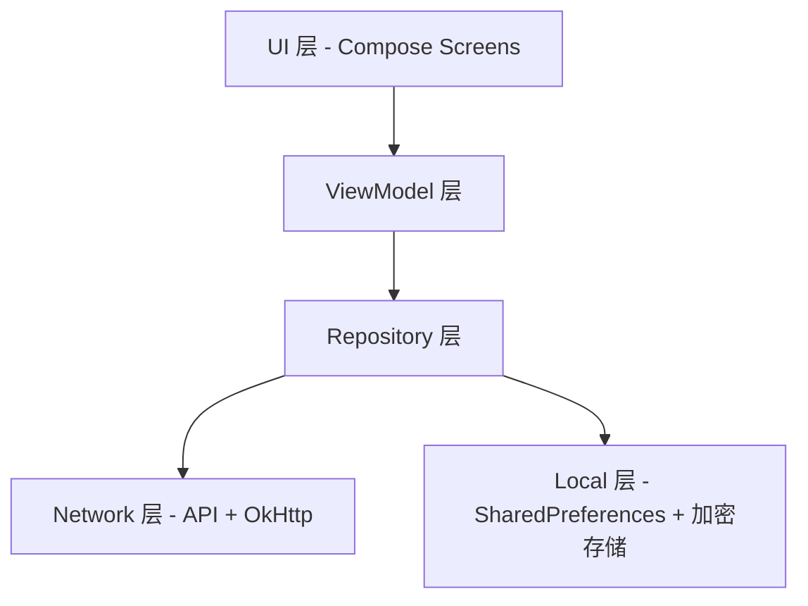

# 电费查询 — 校园服务 Android 客户端

基于 **Kotlin + Jetpack Compose** 构建的校园综合服务应用，主要功能包括电费查询与充值、校园卡服务、办事大厅、扫码支付、桌面快捷方式等。

---

## 技术栈

| 类别      | 技术选型                                          |
|---------|-----------------------------------------------|
| 语言      | Kotlin 2.3.21                                 |
| UI 框架   | Jetpack Compose (BOM 2026.05.01) + Material 3 |
| 网络请求    | OkHttp 5.3.2                                  |
| JSON 解析 | Gson 2.14.0                                   |
| 异步框架    | Kotlin Coroutines 1.11.0                      |
| 导航      | Navigation Compose 2.9.8                      |
| 图片加载    | Coil 2.7.0                                    |
| 二维码     | ZXing 3.5.4                                   |
| 相机      | CameraX 1.6.1                                 |
| 动态取色    | MaterialKolor 4.1.1                           |
| 加密存储    | AndroidX Security Crypto 1.1.0                |
| 构建系统    | Gradle + AGP 9.1.1 + Version Catalog          |

---

## 架构概览

项目采用 **单 Activity + Compose Navigation** 架构，按功能模块分包，数据层遵循 Repository 模式：



---

## 项目目录结构

```
app/src/main/java/edu/cqwu/electricity/
  app/                     # app entry + navigation
  login/                   # data/ + ui/
  electricity/             # data/ + ui/
  cardcenter/              # data/ + ui/
  feeservicehall/          # data/ + ui/
  payment/                 # data/ + ui/
  settings/                # data/ + ui/ + util/
  theme/                   # ui/ + util/
  home/                    # data/ + ui/
  hall/                    # data/ + ui/
  profile/                 # data/ + ui/
  notice/                  # data/ + ui/
  speakup/                 # data/ + ui/
  feedback/                # ui/ + util/
  qrcode/                  # data/ + ui/
  scan/                    # ui/
  shortcut/                # ui/ + util/
  webview/                 # ui/ + util/
```

---

## 文件详解

<details>
<summary>1. 根目录配置文件</summary>

| 文件 | 作用 |
|------|------|
| [`build.gradle.kts`](build.gradle.kts) | 项目根构建脚本，声明插件（Android Application、Kotlin Compose）供子模块引用，本身不包含具体构建逻辑 |
| [`settings.gradle.kts`](settings.gradle.kts) | 项目设置文件：定义项目名称为「电费查询」、配置 Maven 仓库（Google、MavenCentral）、引入 `:app` 模块 |
| [`gradle.properties`](gradle.properties) | Gradle 全局属性配置，如 JVM 内存参数、AndroidX 启用等 |
| [`gradle/libs.versions.toml`](gradle/libs.versions.toml) | **版本目录**（Version Catalog），集中管理所有依赖库的版本号、库声明和插件声明，避免各模块版本不一致 |
| [`gradle/gradle-daemon-jvm.properties`](gradle/gradle-daemon-jvm.properties) | Gradle Daemon 的 JVM 配置 |
| [`gradle/wrapper/gradle-wrapper.jar`](gradle/wrapper/gradle-wrapper.jar) | Gradle Wrapper JAR，确保团队成员使用一致的 Gradle 版本 |
| [`local.properties`](local.properties) | 本地环境配置（SDK 路径等），不纳入版本控制 |

</details>

<details>
<summary>2. CI/CD</summary>

| 文件 | 作用 |
|------|------|
| [`.github/workflows/build.yml`](.github/workflows/build.yml) | GitHub Actions 工作流：在 push/PR 到 `main` 分支时自动构建 Debug 和 Release APK，并上传为 Artifact |

</details>

<details>
<summary>3. App 模块配置</summary>

| 文件 | 作用 |
|------|------|
| [`app/build.gradle.kts`](app/build.gradle.kts) | app 模块构建脚本：配置 compileSdk 36、minSdk 23、targetSdk 36；启用 Compose 和 BuildConfig；声明所有依赖；实现 **versionCode 自动递增**（每次 assemble 后 +1）；注入 `BUILD_TIME`、`GIT_COMMIT_HASH`、`BUILD_SOURCE` 到 BuildConfig |
| [`app/version.properties`](app/version.properties) | 记录当前 versionCode（当前值：1420），由构建脚本自动更新 |
| [`app/proguard-rules.pro`](app/proguard-rules.pro) | Release 构建的 ProGuard/R8 混淆规则 |
| [`app/src/main/AndroidManifest.xml`](app/src/main/AndroidManifest.xml) | 应用清单：声明 `INTERNET` 和 `CAMERA` 权限、注册 `ElectricityApp` 为 Application、注册 `MainActivity` 为启动 Activity（`adjustResize`）、配置 FileProvider |

</details>

<details>
<summary>4. 应用入口</summary>

| 文件 | 作用 |
|------|------|
| [`ElectricityApp.kt`](app/src/main/java/edu/cqwu/electricity/ElectricityApp.kt) | 自定义 `Application` 类。负责：① 初始化 `CrashHandler`（崩溃捕获）；② 初始化 `CookieStore`（Cookie 管理器）；③ 配置 Coil `ImageLoader`（内存缓存 30%、磁盘缓存 100MB、crossfade 动画） |
| [`MainActivity.kt`](app/src/main/java/edu/cqwu/electricity/MainActivity.kt) | 唯一 Activity。启用边到边绘制，管理全局状态（夜间模式、主题颜色源、动画设置、标题栏样式、二维码设置），通过 `CompositionLocalProvider` 向下传递设置状态，挂载 `AppShell` 导航壳。支持桌面快捷方式启动时的路由分发 |

</details>

<details>
<summary>5. 数据层 — data/local（本地存储）</summary>

| 文件 | 作用 |
|------|------|
| [`AccountStore.kt`](app/src/main/java/edu/cqwu/electricity/data/local/AccountStore.kt) | 多账号持久化存储（加密版）。使用 `EncryptedSharedPreferences`（AES-256）加密保存学号和密码，支持多账号列表管理、记住密码开关 |
| [`SettingsPreferences.kt`](app/src/main/java/edu/cqwu/electricity/data/local/SettingsPreferences.kt) | 应用设置持久化存储。保存：夜间模式（跟随系统/浅色/深色）、主题颜色源（动态取色/自定义种子色）、页面过渡动画类型、减少动画开关、QR 码设置（颜色模式、圆角、屏幕亮度）、自定义服务入口列表、WebView User-Agent 配置、应用语言偏好等。定义了 `NightMode`、`ThemeColorSource`、`PageTransition`、`ReduceMotion` 等枚举 |
| [`CredentialExporter.kt`](app/src/main/java/edu/cqwu/electricity/data/local/CredentialExporter.kt) | 凭据加密导出/解密导入工具。使用 PBKDF2-HMAC-SHA256 派生密钥 + AES-256-GCM 认证加密，输出 Base64 格式，支持多账号批量导出 |

</details>

<details>
<summary>6. 数据层 — data/model（数据模型）</summary>

| 文件 | 作用 |
|------|------|
| [`Models.kt`](app/src/main/java/edu/cqwu/electricity/data/model/Models.kt) | **核心数据模型集合**，包含：`BuildingNode`（楼栋树节点）、`BalanceResponse`（电费余额响应）、`UsageRecord`/`UsageResponse`（用电记录）、`HourDataRecord`（小时级用电）、`CurrentDataResponse`（电表实时数据：电流/电压/功率）、`RechargeResponse`（充值响应）、`BuyRecord`/`BuyListResponse`（充值记录）、`UserRoomInfo`（用户房间信息）、`SelectionStep` 枚举、`DetailType` 枚举、支付方式相关模型等 |
| [`AccountInfo.kt`](app/src/main/java/edu/cqwu/electricity/data/model/AccountInfo.kt) | EPay 账户信息模型（与 `AccountStore` 的本地存储模型不同） |
| [`StudentInfo.kt`](app/src/main/java/edu/cqwu/electricity/data/model/StudentInfo.kt) | 学生信息模型 |
| [`HallItem.kt`](app/src/main/java/edu/cqwu/electricity/data/model/HallItem.kt) | 办事大厅应用条目模型 |
| [`HomeData.kt`](app/src/main/java/edu/cqwu/electricity/data/model/HomeData.kt) | 首页数据模型 |
| [`HomeAppIds.kt`](app/src/main/java/edu/cqwu/electricity/data/model/HomeAppIds.kt) | 首页应用 ID 常量定义 |
| [`CustomServiceEntry.kt`](app/src/main/java/edu/cqwu/electricity/data/model/CustomServiceEntry.kt) | 用户自定义服务入口模型 |

</details>

<details>
<summary>7. 数据层 — data/network（网络与加密）</summary>

网络层已按子系统重组为 7 个子目录：

<details>
<summary>7.1 auth/ — 认证子系统</summary>

| 文件 | 作用 |
|------|------|
| [`CasAuthApi.kt`](app/src/main/java/edu/cqwu/electricity/data/network/auth/CasAuthApi.kt) | CAS 统一认证登录 API。实现完整的 CAS 登录流程：获取登录页 → 解析 salt/lt/execution → AES-CBC 加密密码 → POST 登录 → 提取 CASTGC Cookie |
| [`AesEncrypt.kt`](app/src/main/java/edu/cqwu/electricity/data/network/auth/AesEncrypt.kt) | AES-CBC 加密工具（用于 CAS 登录密码加密），生成 64 位随机字符前缀 + AES/CBC/PKCS5Padding |
| [`QrLoginApi.kt`](app/src/main/java/edu/cqwu/electricity/data/network/auth/QrLoginApi.kt) | 扫码登录 API。处理扫码登录的轮询和确认流程 |
| [`SessionManager.kt`](app/src/main/java/edu/cqwu/electricity/data/network/auth/SessionManager.kt) | 会话管理器（Step 1：认证验证）。负责验证 CAS 登录态是否有效，提供 Cookie 验证、CAS 登录页检测等能力 |
| [`SessionTypes.kt`](app/src/main/java/edu/cqwu/electricity/data/network/auth/SessionTypes.kt) | 会话类型定义：`CasUserInfo`（学号+实名）、`SessionValidationResult` 密封类（有效/无效/网络错误）、`SessionExpiredException` 异常类 |
| [`HtmlFormParser.kt`](app/src/main/java/edu/cqwu/electricity/data/network/auth/HtmlFormParser.kt) | HTML 表单解析工具。合并了原 CasAuthApi 和 QrLoginApi 中重复的 `extractInputValue`/`extractRegex` 逻辑，以及原 SessionChecker 中的 CAS 登录页检测逻辑 |
| [`AccountManager.kt`](app/src/main/java/edu/cqwu/electricity/data/network/auth/AccountManager.kt) | 多用户 Cookie 管理器。管理多个用户的 `UserCookieStore`，提供用户切换、Cookie 同步功能 |

</details>

<details>
<summary>7.2 campusphere/ — 校园网 API</summary>

| 文件 | 作用 |
|------|------|
| [`CampusphereApi.kt`](app/src/main/java/edu/cqwu/electricity/data/network/campusphere/CampusphereApi.kt) | 校园网/Campusphere 相关 API |

</details>

<details>
<summary>7.3 common/ — 通用网络组件</summary>

| 文件 | 作用 |
|------|------|
| [`CookieStore.kt`](app/src/main/java/edu/cqwu/electricity/data/network/common/CookieStore.kt) | 统一的 Cookie 管理层，桥接 `android.webkit.CookieManager` 实现磁盘持久化，提供增删改查等基础 API |
| [`CookieStoreOkHttpJar.kt`](app/src/main/java/edu/cqwu/electricity/data/network/common/CookieStoreOkHttpJar.kt) | OkHttp `CookieJar` 实现，将 OkHttp 的 Cookie 读写桥接到 `CookieStore`，使 OkHttp 与 WebView 共享同一 Cookie Session |
| [`UserAgentProvider.kt`](app/src/main/java/edu/cqwu/electricity/data/network/common/UserAgentProvider.kt) | User-Agent 提供者（含 `UserAgentInterceptor`）。组合内置预设 + 用户自定义条目，根据当前选中 ID 返回对应的 UA 字符串。`UserAgentInterceptor` 作为 OkHttp 拦截器自动将 UA 注入到所有 HTTP 请求 |
| [`WebVpnEncoder.kt`](app/src/main/java/edu/cqwu/electricity/data/network/common/WebVpnEncoder.kt) | WebVPN URL 加密转换工具。将外网 URL 通过 AES-128-CBC 加密转换为 `clientvpn.cqwu.edu.cn` 代理 URL，支持正向转换和反向解码 |

</details>

<details>
<summary>7.4 feeservicehall/ — 缴费服务大厅</summary>

| 文件 | 作用 |
|------|------|
| [`FeeModels.kt`](app/src/main/java/edu/cqwu/electricity/data/network/feeservicehall/FeeModels.kt) | 缴费服务大厅数据模型（`FeeCategory`、`FeeItem`、`ApiBusinessException` 等）和通用 API 响应解析器 |
| [`FeeServiceHallApi.kt`](app/src/main/java/edu/cqwu/electricity/data/network/feeservicehall/FeeServiceHallApi.kt) | 缴费服务大厅 API，封装订单查询、订单详情、JWT Token 获取等接口 |

</details>

<details>
<summary>7.5 pay/ — 支付子系统</summary>

| 文件 | 作用 |
|------|------|
| [`HttpClientFactory.kt`](app/src/main/java/edu/cqwu/electricity/data/network/pay/HttpClientFactory.kt) | 统一的 OkHttpClient 工厂。消除项目中散落的 OkHttpClient 构建代码，统一使用 `PreferIPv4Dns` + `UserAgentInterceptor` 基础配置。提供 `shared`（全局共享）、`createForUser`（按用户隔离）、`createNoRedirect`（禁用重定向）等创建方式 |
| [`PayApiBase.kt`](app/src/main/java/edu/cqwu/electricity/data/network/pay/PayApiBase.kt) | 支付 API 公共基类。提供 `PAY_DOMAIN` 常量、`client`/`gson` 实例、`buildBaseRequest` 请求构建、`autoRetry` 自动重试等公共逻辑，供 `ElectricityPayApi` 和 `CardRechargeApi` 继承 |
| [`ElectricityApi.kt`](app/src/main/java/edu/cqwu/electricity/data/network/pay/electricityrecharge/ElectricityApi.kt) | 电费系统核心 API。封装楼栋查询、余额查询、6 个月用电、本月每日用电、24 小时用电明细、电表实时数据等接口 |
| [`ElectricityPayApi.kt`](app/src/main/java/edu/cqwu/electricity/data/network/pay/electricityrecharge/ElectricityPayApi.kt) | 电费充值支付 API。封装 `gotToPay`（POST 支付下单）、`queryOrderStatus`（订单状态轮询）等接口，使用 `PayApiBase` 提供的 JWT Token 认证机制 |
| [`RSAEncrypt.kt`](app/src/main/java/edu/cqwu/electricity/data/network/pay/electricityrecharge/RSAEncrypt.kt) | RSA 加密工具 |
| [`CardRechargeApi.kt`](app/src/main/java/edu/cqwu/electricity/data/network/pay/cardrecharge/CardRechargeApi.kt) | 校园卡充值 API。封装校园卡充值下单、订单状态查询等接口，复用 `FeeServiceHallApi` 的 JWT Token 认证体系 |

</details>

<details>
<summary>7.6 qrcode/ — 二维码</summary>

| 文件 | 作用 |
|------|------|
| [`QrCodeApi.kt`](app/src/main/java/edu/cqwu/electricity/data/network/qrcode/QrCodeApi.kt) | 二维码 API。获取支付码/乘车码，通过 followRedirects 自动完成 CAS ticket 交换 |

</details>

<details>
<summary>7.7 sso/ — SSO 服务授权</summary>

| 文件 | 作用 |
|------|------|
| [`ServiceLoginManager.kt`](app/src/main/java/edu/cqwu/electricity/data/network/sso/ServiceLoginManager.kt) | 统一的服务授权管理器（Step 2）。负责使用 CAS CASTGC Cookie 获取各第三方服务的 session Cookie。采用手动逐步跟踪 302 重定向链的 IAP 认证流程，使用 `followRedirects=false` 配合 `CookieStoreOkHttpJar` 桥接 CookieManager，避免被 IAP 的 JS 中间页面阻断登录链路 |

</details>

</details>

<details>
<summary>8. 数据层 — data/repository（数据仓库）</summary>

| 文件 | 作用 |
|------|------|
| [`ElectricityRepository.kt`](app/src/main/java/edu/cqwu/electricity/data/repository/ElectricityRepository.kt) | 电费数据仓库，封装电费相关 API 调用，供 ViewModel 层消费 |
| [`LoginRepository.kt`](app/src/main/java/edu/cqwu/electricity/data/repository/LoginRepository.kt) | 登录数据仓库，封装 CAS 登录、会话管理等逻辑 |
| [`HallFavoriteApi.kt`](app/src/main/java/edu/cqwu/electricity/data/repository/HallFavoriteApi.kt) | 办事大厅收藏 API，处理应用收藏/取消收藏 |
| [`HallServiceCenterApi.kt`](app/src/main/java/edu/cqwu/electricity/data/repository/HallServiceCenterApi.kt) | 办事大厅服务中心 API，获取全部应用列表 |
| [`HallJsonLoader.kt`](app/src/main/java/edu/cqwu/electricity/data/repository/HallJsonLoader.kt) | 办事大厅 JSON 数据加载器，从 `assets/hall_apps.json` 加载本地配置 |
| [`HomeJsonLoader.kt`](app/src/main/java/edu/cqwu/electricity/data/repository/HomeJsonLoader.kt) | 首页 JSON 数据加载器，从 `assets/home_apps.json` 加载本地配置 |

</details>

<details>
<summary>9. UI 层 — navigation（导航系统）</summary>

| 文件 | 作用 |
|------|------|
| [`NavGraph.kt`](app/src/main/java/edu/cqwu/electricity/ui/navigation/NavGraph.kt) | **导航图核心文件**。定义所有路由常量（`Routes` 对象）和 `NavHost`，管理页面跳转与参数传递，实现页面过渡动画（支持滑动、淡入、缩放、Cupertino 等 6 种效果）。支持桌面快捷方式启动时的路由分发 |
| [`AppShell.kt`](app/src/main/java/edu/cqwu/electricity/ui/navigation/AppShell.kt) | 导航壳组件，包含底部导航栏和 `NavHost`，是整个应用的 UI 骨架 |
| [`BottomNavTab.kt`](app/src/main/java/edu/cqwu/electricity/ui/navigation/BottomNavTab.kt) | 底部导航栏 Tab 定义（首页、我的等） |
| [`MainTabScreen.kt`](app/src/main/java/edu/cqwu/electricity/ui/navigation/MainTabScreen.kt) | 主 Tab 页面容器，使用 `HorizontalPager` 实现左右滑动切换 Tab |

</details>

<details>
<summary>10. UI 层 — home（首页）</summary>

| 文件 | 作用 |
|------|------|
| [`HomeScreen.kt`](app/src/main/java/edu/cqwu/electricity/ui/home/HomeScreen.kt) | 首页界面（1000+ 行）。展示校园服务入口网格（电费查询、充值、卡中心、办事大厅等），支持搜索、下拉刷新、自定义服务入口管理（含自定义网站图标/标题/网址）、打开外部链接等 |
| [`HomeViewModel.kt`](app/src/main/java/edu/cqwu/electricity/ui/home/HomeViewModel.kt) | 首页 ViewModel，管理首页数据加载与状态 |

</details>

<details>
<summary>11. UI 层 — login（登录）</summary>

| 文件 | 作用 |
|------|------|
| [`LoginScreen.kt`](app/src/main/java/edu/cqwu/electricity/ui/login/LoginScreen.kt) | 登录界面。支持学号+密码登录，提供多账号管理、记住密码、凭据导入导出、其他登录方式入口（扫码登录、手机号找回、邮箱找回）等功能 |
| [`LoginViewModel.kt`](app/src/main/java/edu/cqwu/electricity/ui/login/LoginViewModel.kt) | 登录 ViewModel，处理登录逻辑、错误提示、会话管理、智能切换账号（含 Cookie 串号校验） |
| [`QrLoginScreen.kt`](app/src/main/java/edu/cqwu/electricity/ui/login/QrLoginScreen.kt) | 扫码登录界面，展示二维码供用户扫码认证 |
| [`AccountManagerSheet.kt`](app/src/main/java/edu/cqwu/electricity/ui/login/AccountManagerSheet.kt) | 账号管理底部弹窗，支持查看、切换、删除、新增账号等操作 |
| [`DeleteAccountSheet.kt`](app/src/main/java/edu/cqwu/electricity/ui/login/DeleteAccountSheet.kt) | 删除账号确认弹窗 |
| [`ExportCredentialDialog.kt`](app/src/main/java/edu/cqwu/electricity/ui/login/ExportCredentialDialog.kt) | 凭据导出对话框，生成加密的 Base64 凭据字符串供备份 |
| [`ImportCredentialDialog.kt`](app/src/main/java/edu/cqwu/electricity/ui/login/ImportCredentialDialog.kt) | 凭据导入对话框，解析 Base64 凭据字符串恢复账号 |
| [`SecurityNoticeSheet.kt`](app/src/main/java/edu/cqwu/electricity/ui/login/SecurityNoticeSheet.kt) | 安全提示弹窗，凭据导入导出前的安全警告 |

</details>

<details>
<summary>12. UI 层 — electricity（电费查询）</summary>

| 文件 | 作用 |
|------|------|
| [`ElectricityMainScreen.kt`](app/src/main/java/edu/cqwu/electricity/ui/electricity/ElectricityMainScreen.kt) | 电费查询主入口页面 |
| [`ElectricityViewModel.kt`](app/src/main/java/edu/cqwu/electricity/ui/electricity/ElectricityViewModel.kt) | 电费查询 ViewModel，管理楼栋选择、余额查询等状态 |
| [`BuildingSelectionScreen.kt`](app/src/main/java/edu/cqwu/electricity/ui/electricity/BuildingSelectionScreen.kt) | 楼栋选择页面（校区→楼栋→楼层→房间 多级选择） |
| [`DashboardScreen.kt`](app/src/main/java/edu/cqwu/electricity/ui/electricity/DashboardScreen.kt) | 电费仪表盘页面，展示余额、用电趋势图表、快捷操作入口 |
| [`DetailScreen.kt`](app/src/main/java/edu/cqwu/electricity/ui/electricity/DetailScreen.kt) | 用电详情页面（6 个月记录/本月每日/24 小时明细/电表状态） |
| [`DetailViewModel.kt`](app/src/main/java/edu/cqwu/electricity/ui/electricity/DetailViewModel.kt) | 详情页 ViewModel |

</details>

<details>
<summary>13. UI 层 — recharge（充值）与 paycommom（支付公共组件）</summary>

| 文件 | 作用 |
|------|------|
| [`RechargeScreen.kt`](app/src/main/java/edu/cqwu/electricity/ui/recharge/RechargeScreen.kt) | 电费充值页面，输入金额并选择支付方式 |
| [`RechargeViewModel.kt`](app/src/main/java/edu/cqwu/electricity/ui/recharge/RechargeViewModel.kt) | 电费充值 ViewModel，管理充值流程状态 |
| [`PaymentSelectionScreen.kt`](app/src/main/java/edu/cqwu/electricity/ui/recharge/PaymentSelectionScreen.kt) | 支付方式选择页面 |
| [`RechargeRecordScreen.kt`](app/src/main/java/edu/cqwu/electricity/ui/recharge/RechargeRecordScreen.kt) | 充值记录查询页面 |
| [`PaymentState.kt`](app/src/main/java/edu/cqwu/electricity/ui/paycommom/PaymentState.kt) | 支付流程共享状态，电费充值和校园卡充值共用，统一管理支付方式选择、支付提交、订单轮询等状态 |
| [`PaymentFlowDelegate.kt`](app/src/main/java/edu/cqwu/electricity/ui/paycommom/PaymentFlowDelegate.kt) | 支付流程委托，封装 `RechargeViewModel` 和 `CardRechargeViewModel` 共有的支付流程逻辑（支付方式选择、提交支付、订单状态轮询） |
| [`PaymentOverlay.kt`](app/src/main/java/edu/cqwu/electricity/ui/paycommom/PaymentOverlay.kt) | 支付 WebView 覆盖层，处理支付宝自动提交表单和微信 H5 支付页面的加载与回调 |
| [`PaymentConfirmScreen.kt`](app/src/main/java/edu/cqwu/electricity/ui/paycommom/PaymentConfirmScreen.kt) | 支付确认页面，展示订单金额、支付状态和支付结果 |
| [`AmountGrid.kt`](app/src/main/java/edu/cqwu/electricity/ui/paycommom/AmountGrid.kt) | 预设金额网格组件，电费充值和校园卡充值共用的金额选择组件 |

</details>

<details>
<summary>14. UI 层 — cardcenter（校园卡中心）</summary>

| 文件 | 作用 |
|------|------|
| [`CardCenterScreen.kt`](app/src/main/java/edu/cqwu/electricity/ui/cardcenter/CardCenterScreen.kt) | 校园卡中心主页 |
| [`AccountInfoScreen.kt`](app/src/main/java/edu/cqwu/electricity/ui/cardcenter/AccountInfoScreen.kt) | 账户信息页面 |
| [`BillScreen.kt`](app/src/main/java/edu/cqwu/electricity/ui/cardcenter/BillScreen.kt) | 账单查询页面（含筛选面板） |
| [`BillViewModel.kt`](app/src/main/java/edu/cqwu/electricity/ui/cardcenter/BillViewModel.kt) | 账单 ViewModel |
| [`CardLostScreen.kt`](app/src/main/java/edu/cqwu/electricity/ui/cardcenter/CardLostScreen.kt) | 卡挂失页面 |
| [`CardRechargeScreen.kt`](app/src/main/java/edu/cqwu/electricity/ui/cardcenter/CardRechargeScreen.kt) | 校园卡充值页面，输入学号和金额，支持金额选择和自定义输入 |
| [`CardRechargeViewModel.kt`](app/src/main/java/edu/cqwu/electricity/ui/cardcenter/CardRechargeViewModel.kt) | 校园卡充值 ViewModel，管理充值流程状态（复用 `PaymentFlowDelegate`） |
| [`CardPaymentScreen.kt`](app/src/main/java/edu/cqwu/electricity/ui/cardcenter/CardPaymentScreen.kt) | 校园卡充值支付执行页面，复用 `PaymentConfirmScreen` 展示支付确认与结果 |

</details>

<details>
<summary>15. UI 层 — feeservicehall（缴费服务大厅）</summary>

| 文件 | 作用 |
|------|------|
| [`FeeServiceHallScreen.kt`](app/src/main/java/edu/cqwu/electricity/ui/feeservicehall/FeeServiceHallScreen.kt) | 缴费服务大厅主页 |
| [`FeeServiceHallViewModel.kt`](app/src/main/java/edu/cqwu/electricity/ui/feeservicehall/FeeServiceHallViewModel.kt) | 大厅 ViewModel |
| [`FeeServiceHallOrderTab.kt`](app/src/main/java/edu/cqwu/electricity/ui/feeservicehall/FeeServiceHallOrderTab.kt) | 订单列表 Tab 页 |
| [`FeeServiceHallProfileTab.kt`](app/src/main/java/edu/cqwu/electricity/ui/feeservicehall/FeeServiceHallProfileTab.kt) | 个人资料 Tab 页 |
| [`OrderDetailScreen.kt`](app/src/main/java/edu/cqwu/electricity/ui/feeservicehall/OrderDetailScreen.kt) | 订单详情页面 |

</details>

<details>
<summary>16. UI 层 — hall（办事大厅）</summary>

| 文件 | 作用 |
|------|------|
| [`HallScreen.kt`](app/src/main/java/edu/cqwu/electricity/ui/hall/HallScreen.kt) | 办事大厅页面，展示校内应用列表，支持收藏管理 |
| [`HallViewModel.kt`](app/src/main/java/edu/cqwu/electricity/ui/hall/HallViewModel.kt) | 办事大厅 ViewModel |

</details>

<details>
<summary>17. UI 层 — notice（通知公告）</summary>

| 文件 | 作用 |
|------|------|
| [`NoticeScreen.kt`](app/src/main/java/edu/cqwu/electricity/ui/notice/NoticeScreen.kt) | 通知公告列表页面 |
| [`NoticeDetailScreen.kt`](app/src/main/java/edu/cqwu/electricity/ui/notice/NoticeDetailScreen.kt) | 通知公告详情页面 |
| [`NoticeViewModel.kt`](app/src/main/java/edu/cqwu/electricity/ui/notice/NoticeViewModel.kt) | 通知公告 ViewModel |
| [`NoticeApi.kt`](app/src/main/java/edu/cqwu/electricity/ui/notice/NoticeApi.kt) | 通知公告 API |

</details>

<details>
<summary>18. UI 层 — profile（个人中心）</summary>

| 文件 | 作用 |
|------|------|
| [`ProfileScreen.kt`](app/src/main/java/edu/cqwu/electricity/ui/profile/ProfileScreen.kt) | 个人中心页面（「我的」Tab），展示用户头像、学号、功能入口列表、桌面快捷方式入口卡片 |
| [`MyInfoScreen.kt`](app/src/main/java/edu/cqwu/electricity/ui/profile/MyInfoScreen.kt) | 我的信息页面，展示详细的学生信息 |
| [`MyInfoViewModel.kt`](app/src/main/java/edu/cqwu/electricity/ui/profile/MyInfoViewModel.kt) | 我的信息 ViewModel |

</details>

<details>
<summary>19. UI 层 — qrcode / scan（二维码与扫码）</summary>

| 文件 | 作用 |
|------|------|
| [`QrCodeDisplayScreen.kt`](app/src/main/java/edu/cqwu/electricity/ui/qrcode/QrCodeDisplayScreen.kt) | 二维码展示页面（支付码、乘车码），支持颜色模式、圆角、屏幕亮度调节 |
| [`ScanScreen.kt`](app/src/main/java/edu/cqwu/electricity/ui/scan/ScanScreen.kt) | 扫码页面，使用 CameraX 实现实时扫码 |

</details>

<details>
<summary>20. UI 层 — settings（设置）</summary>

| 文件 | 作用 |
|------|------|
| [`SettingsScreen.kt`](app/src/main/java/edu/cqwu/electricity/ui/settings/SettingsScreen.kt) | 设置主页 |
| [`PersonalizationScreen.kt`](app/src/main/java/edu/cqwu/electricity/ui/settings/PersonalizationScreen.kt) | 个性化设置页面（夜间模式、主题色、动画效果、语言切换） |
| [`QrCodeSettingsScreen.kt`](app/src/main/java/edu/cqwu/electricity/ui/settings/QrCodeSettingsScreen.kt) | 二维码样式设置页面（颜色模式、圆角、屏幕亮度） |
| [`UserAgentSettingsScreen.kt`](app/src/main/java/edu/cqwu/electricity/ui/settings/UserAgentSettingsScreen.kt) | 浏览器标识 UA 设置页面 |
| [`UserAgentEditScreen.kt`](app/src/main/java/edu/cqwu/electricity/ui/settings/UserAgentEditScreen.kt) | 编辑/添加自定义 UA 条目 |
| [`ConfigScreen.kt`](app/src/main/java/edu/cqwu/electricity/ui/settings/ConfigScreen.kt) | 高级配置页面 |
| [`AboutScreen.kt`](app/src/main/java/edu/cqwu/electricity/ui/settings/AboutScreen.kt) | 关于页面，展示版本信息、构建信息（构建时间、Git commit hash）、联系方式 |
| [`StorageClearScreen.kt`](app/src/main/java/edu/cqwu/electricity/ui/settings/StorageClearScreen.kt) | 存储清理页面，支持选择性清除图片缓存、崩溃日志、临时文件、Cookie、账号数据等 7 类存储 |

</details>

<details>
<summary>21. UI 层 — shortcut（桌面快捷方式）</summary>

| 文件 | 作用 |
|------|------|
| [`AddShortcutScreen.kt`](app/src/main/java/edu/cqwu/electricity/ui/shortcut/AddShortcutScreen.kt) | 桌面快捷方式创建页面。包含预览区、名称输入、底部弹窗选择功能列表，支持 Coil 异步加载图标，通过 `ShortcutHelper` + `ShortcutManagerCompat` 创建 Pinned Shortcut |

</details>

<details>
<summary>22. UI 层 — webview（内置浏览器）</summary>

| 文件 | 作用 |
|------|------|
| [`UnifiedWebViewScreen.kt`](app/src/main/java/edu/cqwu/electricity/ui/webview/UnifiedWebViewScreen.kt) | 通用内置浏览器页面，封装 WebView 组件，支持加载任意 URL、自定义标题、错误页面覆盖等 |

</details>

<details>
<summary>23. UI 层 — feedback（意见反馈）</summary>

| 文件 | 作用 |
|------|------|
| [`FeedbackScreen.kt`](app/src/main/java/edu/cqwu/electricity/ui/feedback/FeedbackScreen.kt) | 意见反馈页面，支持日志附件 |
| [`LogCapture.kt`](app/src/main/java/edu/cqwu/electricity/ui/feedback/LogCapture.kt) | 日志捕获工具，收集应用运行日志用于反馈附件 |

</details>

<details>
<summary>24. UI 层 — myroom（我的宿舍）</summary>

| 文件 | 作用 |
|------|------|
| [`MyRoomViewModel.kt`](app/src/main/java/edu/cqwu/electricity/ui/myroom/MyRoomViewModel.kt) | 我的宿舍 ViewModel，管理用户绑定的房间信息 |

</details>

<details>
<summary>25. UI 层 — components（通用组件）</summary>

| 文件 | 作用 |
|------|------|
| [`BottomSheetDialog.kt`](app/src/main/java/edu/cqwu/electricity/ui/components/BottomSheetDialog.kt) | 底部弹出对话框组件，封装 MD3 `ModalBottomSheet`。支持标题、图标、左右按钮、全屏/半屏模式、键盘弹出自动展开 |
| [`CustomWebsiteDialog.kt`](app/src/main/java/edu/cqwu/electricity/ui/components/CustomWebsiteDialog.kt) | 自定义网站输入对话框，支持选择本地图标、输入标题和网址 |
| [`DatePickerField.kt`](app/src/main/java/edu/cqwu/electricity/ui/components/DatePickerField.kt) | 日期选择器组件，封装 MD3 `DatePickerDialog`，支持文本输入和日历弹窗选择 |
| [`LanguageSwitchComponents.kt`](app/src/main/java/edu/cqwu/electricity/ui/components/LanguageSwitchComponents.kt) | 语言切换组件，支持 6 种语言选择（中文、英文、日文、繁体中文、法语、阿拉伯语） |
| [`LineChartCard.kt`](app/src/main/java/edu/cqwu/electricity/ui/components/LineChartCard.kt) | 折线图卡片组件（用于用电趋势展示） |
| [`LoadingDialog.kt`](app/src/main/java/edu/cqwu/electricity/ui/components/LoadingDialog.kt) | 加载中对话框组件（Card 包裹，圆角 + 阴影） |
| [`OpenUrlDialog.kt`](app/src/main/java/edu/cqwu/electricity/ui/components/OpenUrlDialog.kt) | 打开链接确认对话框 |
| [`QrCodeView.kt`](app/src/main/java/edu/cqwu/electricity/ui/components/QrCodeView.kt) | 二维码渲染组件（基于 ZXing） |
| [`ReLoginContent.kt`](app/src/main/java/edu/cqwu/electricity/ui/components/ReLoginContent.kt) | 重新登录提示内容组件（会话过期时展示） |
| [`SnackbarController.kt`](app/src/main/java/edu/cqwu/electricity/ui/components/SnackbarController.kt) | Snackbar 消息控制器 |
| [`WebViewErrorOverlay.kt`](app/src/main/java/edu/cqwu/electricity/ui/components/WebViewErrorOverlay.kt) | WebView 错误覆盖层组件，WebView 加载失败时显示自定义错误页面 |

</details>

<details>
<summary>26. UI 层 — theme（主题系统）</summary>

| 文件 | 作用 |
|------|------|
| [`Theme.kt`](app/src/main/java/edu/cqwu/electricity/ui/theme/Theme.kt) | Material 3 主题定义。支持夜间模式切换、动态取色（Material You）和自定义种子色，管理状态栏图标颜色、`CompositionLocal` 等 |
| [`Color.kt`](app/src/main/java/edu/cqwu/electricity/ui/theme/Color.kt) | 颜色常量定义 |
| [`Type.kt`](app/src/main/java/edu/cqwu/electricity/ui/theme/Type.kt) | 字体排版样式定义 |
| [`ThemeColorGenerator.kt`](app/src/main/java/edu/cqwu/electricity/ui/theme/ThemeColorGenerator.kt) | 主题色生成器，基于 MaterialKolor 从种子色生成完整调色板 |

</details>

<details>
<summary>27. 工具类 — util</summary>

| 文件 | 作用 |
|------|------|
| [`CrashHandler.kt`](app/src/main/java/edu/cqwu/electricity/util/CrashHandler.kt) | 全局崩溃捕获器，捕获未处理异常并保存崩溃日志到本地 |
| [`LocaleContextWrapper.kt`](app/src/main/java/edu/cqwu/electricity/util/LocaleContextWrapper.kt) | 语言上下文包装器，根据用户语言偏好包装 Context 实现应用内语言切换 |
| [`ShortcutHelper.kt`](app/src/main/java/edu/cqwu/electricity/util/ShortcutHelper.kt) | 桌面快捷方式工具类，封装 `createPinnedShortcut`、`extractShortcutAppInfo`、`loadIconFromUrl`（Coil 下载 + `Bitmap.copy` 防缓存回收） |
| [`StorageManager.kt`](app/src/main/java/edu/cqwu/electricity/util/StorageManager.kt) | 存储空间管理工具类，封装 7 类存储的大小计算和清除逻辑（图片缓存、崩溃日志、临时文件、Cookie、账号数据等） |
| [`ToastUtils.kt`](app/src/main/java/edu/cqwu/electricity/util/ToastUtils.kt) | Toast 工具类 |
| [`WebViewUrlUtil.kt`](app/src/main/java/edu/cqwu/electricity/util/WebViewUrlUtil.kt) | WebView URL 处理工具 |

</details>

<details>
<summary>28. 静态资源 — assets</summary>

| 文件 | 作用 |
|------|------|
| [`hall_apps.json`](app/src/main/assets/hall_apps.json) | 办事大厅应用列表本地配置，作为网络请求失败时的兜底数据 |
| [`home_apps.json`](app/src/main/assets/home_apps.json) | 首页服务入口应用列表本地配置 |

</details>

<details>
<summary>29. Android 资源 — res</summary>

| 文件/目录 | 作用 |
|-----------|------|
| `res/values/strings*.xml` | 按功能模块拆分的字符串资源（共 16 个文件：主 strings、login、electricity、recharge、home、profile、settings、notice、cardcenter、feehall、qrcode、webview、dialogs、feedback、shortcut 等） |
| `res/values/colors.xml` | 颜色资源 |
| `res/values/themes.xml` | 浅色主题样式 |
| `res/values-night/themes.xml` | 深色主题样式 |
| `res/values-{ar,en,fr,ja,zh-rTW}/` | **6 语言国际化**：阿拉伯语、英语、法语、日语、繁体中文，每个语言目录下包含对应的所有 strings 文件 |
| `res/drawable/ic_launcher_background.xml` | 启动图标背景 |
| `res/drawable-v24/ic_launcher_foreground.xml` | 启动图标前景（API 24+自适应图标） |
| `res/mipmap-*/` | 各分辨率启动图标（webp 格式） |
| `res/xml/backup_rules.xml` | Android 备份规则 |
| `res/xml/data_extraction_rules.xml` | 数据提取规则 |
| `res/xml/file_paths.xml` | FileProvider 路径配置（用于日志文件分享等） |

</details>

---

## 国际化

应用支持 **6 种语言**，通过 Android 资源限定符实现：

| 语言 | 资源目录 | 说明 |
|------|---------|------|
| 简体中文 | `values/` | 默认语言 |
| English | `values-en/` | 英语 |
| 日本語 | `values-ja/` | 日语 |
| 繁體中文 | `values-zh-rTW/` | 繁体中文 |
| Français | `values-fr/` | 法语 |
| العربية | `values-ar/` | 阿拉伯语（RTL 布局支持） |

语言切换通过 [`LanguageSwitchComponents.kt`](app/src/main/java/edu/cqwu/electricity/ui/components/LanguageSwitchComponents.kt) 实现，使用 [`LocaleContextWrapper.kt`](app/src/main/java/edu/cqwu/electricity/util/LocaleContextWrapper.kt) 在应用内动态切换语言。

---

## 构建与运行

```bash
# 构建 Debug APK
./gradlew assembleDebug

# 构建 Release APK（使用 debug 签名）
./gradlew assembleRelease
```

> **注意：** 每次构建后 `app/version.properties` 中的 `VERSION_CODE` 会自动递增。构建信息（时间、Git commit hash、构建来源）会注入到 `BuildConfig` 中。

---

## 权限说明

| 权限 | 用途 |
|------|------|
| `INTERNET` | 网络请求（API 调用、WebView 加载） |
| `CAMERA` | 扫码功能（ZXing 二维码识别） |
