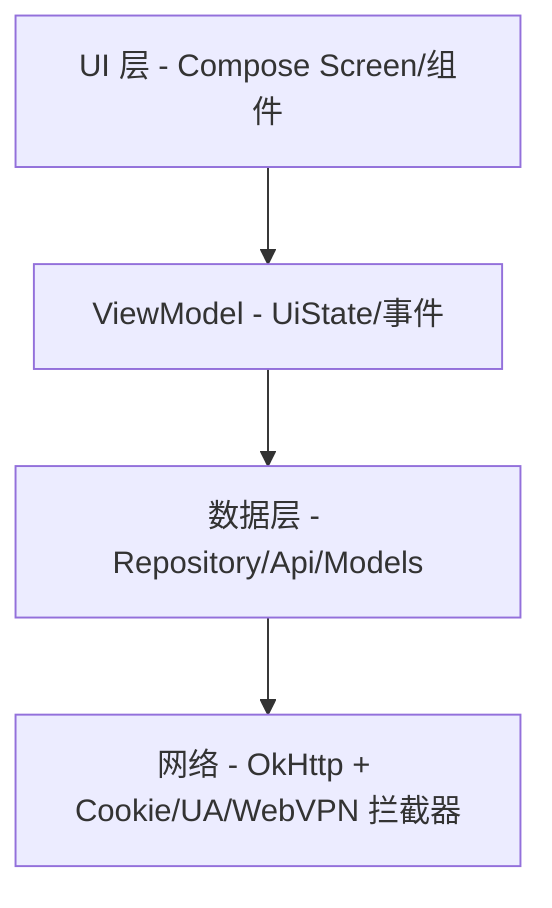

# 电费查询 — 校园服务 Android 客户端

基于 **Kotlin + Jetpack Compose** 构建的校园综合服务应用。接入学校统一认证（CAS）、电费系统、校园卡/缴费平台与校园网关，覆盖电费查询充值、用量报表（表格 + 折线图）、补助记录、账单、办事大厅、扫码、桌面快捷方式等日常服务。

---

## 功能概览

| 模块 | 功能 |
|------|------|
| 登录/账号 | 学号密码登录、扫码登录、多账号切换、记住密码、凭据加密导入导出、会话校验与自动重登 |
| 账号管理 | 修改用户名/密码、在线设备管理、认证日志（按类型/结果/时间筛选，可分页） |
| 电费 | 楼栋房间选择、余额查询、充值（电费/校园卡）、充值记录、用电明细（小时/每日/每月）、用量报表与补助记录（支持表格 ⇄ 折线图切换、按压查看详情）、电表实时状态 |
| 校园卡中心 | 账户信息、账单查询（Tab + 筛选）、挂失、充值、银行卡绑定 |
| 缴费/办事 | 缴费服务大厅（订单/资料 Tab）、办事大厅应用列表（本地 JSON 兜底 + 收藏/搜索） |
| 生活服务 | 首页服务聚合与自定义入口、留言咨询（speakup）、通知公告、人员检索、意见反馈（附日志） |
| 入口与系统 | 桌面快捷方式（Pinned Shortcut）、内置 WebView 浏览器（深色/UA 配置）、WebVPN 访问、扫码（CameraX）与二维码展示（支付码等）、夜间模式、动态取色、6 语言切换、更新自检与下载 |

---

## 技术栈

| 类别 | 选型 |
|------|------|
| 语言 | Kotlin 2.3.21 |
| UI | Jetpack Compose（BOM 2025.11.01）+ Material 3（含 icons-extended）、Haze 1.6.10 |
| 网络 | OkHttp 5.3.2（拦截器体系 + 多客户端工厂） |
| JSON | Gson 2.14.0 |
| 异步 | Kotlin Coroutines 1.11.0 |
| 导航 | Navigation Compose 2.9.8 |
| 图片 | Coil 2.7.0（compose） |
| 相机/扫码 | CameraX 1.4.2 + ZXing 3.5.4 |
| 存储安全 | AndroidX Security Crypto 1.1.0（AES 加密凭据/设置） |
| 取色 | MaterialKolor 3.0.1 |
| 其余 | core-ktx 1.17.0、lifecycle 2.9.4（runtime/compose）、activity-compose 1.11.0、appcompat 1.6.1、SwipeRefreshLayout 1.2.0 |
| 构建 | AGP 9.1.1 + Gradle 9.3.1 + Version Catalog；Java 11 |

## SDK 与系统适配

- `compileSdk 36` / `targetSdk 36` / `minSdk 21`。
- **Edge-to-edge**：`setDecorFitsSystemWindows(false)`，各页面/底部栏/输入场景通过 `WindowInsets` 处理导航栏与键盘遮挡。
- **预测性返回**：Manifest 开启 `enableOnBackInvokedCallback`，导航走 Compose Navigation 返回调度。
- **运行时权限**：相机在扫码页按需申请（含首次说明），其余能力（如文件导出）走系统 SAF 选择器，无需存储权限；不使用通知/前台服务。
- **国际化**：`localeConfig` + per-app language（Android 13+），AAB 开启按语言拆分。
- **release**：R8 混淆，Gson 反序列化相关类保留（`proguard-rules.pro`）。
- 访问学校网关使用 HTTP 明文（`usesCleartextTraffic`），多客户端按账号/会话隔离 Cookie（桥接 `CookieManager`），WebVPN 走 AES URL 加密。

---

## 架构概览

**单 Activity + Compose Navigation**，按功能分包；每个业务模块内部自行组织 data/ui，数据层遵循 Repository 模式（如用量报表/补助记录经 `RecordRepositoryV2` 查询，ViewModel 不直接依赖网络实现）：



## 目录结构

源码位于 `app/src/main/java/edu/cqwu/electricity/`，按包名组织：

| 包 | 职责与主要文件 |
|----|------|
| `app/` | 应用入口与导航壳：`ElectricityApp`、`MainActivity`（edge-to-edge + 全局设置）、`AppShell`（底部导航 + NavHost）、`NavGraph`（路由与转场动画）、`MainTabScreen`、`AppLaunchEffects`、`BottomNavTab` |
| `login/` | 认证体系：CAS 登录/扫码登录、Cookie 存储与桥接（`CookieStore`/`CookieStoreOkHttpJar`）、会话管理、RedirectChain 跟随、AES 加密、凭据导入导出、`CasAuthApi`/`QrLoginApi` 等 |
| `electricity/` | 电费主域：`ElectricityMainScreen`/`DashboardScreen`/`DetailScreen`（电表实时状态）、充值、记录页体系 `RecordListScreen`+`RecordListUi`（可选顶部 Tab + 日期筛选 + 表格/折线统一外壳）、`UsageRecordScreenV2`（小时/每日/每月 Tab + 每 Tab 缓存 + 折线图）、`SubsidyRecordScreen`、`RecordRepositoryV2`/`RecordTextContentV2`/`LineChartV2` |
| `cardcenter/` | 校园卡：账户、账单（Tab+Pager+筛选）、挂失、充值、银行卡绑定（`CardCenterApi`/`BankCardBindApi`） |
| `feeservicehall/` | 缴费服务大厅：`FeeServiceHallScreen` + 订单/资料 Tab、`OrderDetailScreen`、`FeeServiceHallApi` |
| `accountmanagerv2/` | 账号管理 v2：设备管理、认证日志、修改用户名/密码（各自 Screen/ViewModel/Api 三件套） |
| `home/` | 首页聚合：服务网格、自定义服务入口（自定义网址/图标）、`HomeAppLaunch`、本地 JSON 加载 |
| `hall/` | 办事大厅：应用列表/收藏/搜索/服务台（API + `assets/hall_apps.json` 兜底） |
| `profile/` | 个人中心/我的信息/校园网（Campusphere） |
| `person/` | 人员检索（`PersonSearchApi`/`Screen`/`ViewModel`） |
| `speakup/` | 留言咨询与消息列表 |
| `notice/` | 通知公告（列表/详情/API） |
| `scan/` · `qrcode/` | CameraX 扫码（`ScanScreen`）；二维码展示与 API（`QrCodeApi`/`QrCodeDisplayScreen`） |
| `shortcut/` | 桌面快捷方式（`ShortcutManagerCompat` + Coil 图标） |
| `settings/` | 设置与个性化：主题/夜间/取色/动画/语言/UA/二维码样式、存储清理、关于页、WebVPN 设置（`SettingsPreferences` 持久化） |
| `theme/` | 主题系统（Material3 + MaterialKolor 动态取色）、`UiMessage`、`SnackbarController`、`AppSettingsState` 等 |
| `common/` | 通用 UI 组件：`BottomSheetDialog`、`DatePickerField`、`DateRangeFilterRow`、`SectionFilterChip`、`InfoRow`/`LabeledFieldRow`、`LanguageSwitchComponents`、`LineChartV2`（自绘折线图）、`LoadingDialog`、`QrCodeView`、`ReLoginContent`、`WebViewErrorOverlay` 等 |
| `webview/` | 内置浏览器（`UnifiedWebViewScreen` + 深色适配 + UA 工具） |
| `webvpn/` | WebVPN：URL 编解码、请求拦截、会话管理 |
| `update/` | 版本更新：多镜像源探测、下载进度、更新信息（`UpdateCheckCoordinator`/`UpdateRepository` 等） |
| `feedback/` | 意见反馈与崩溃日志（`CrashHandler`） |
| `logging/` | 应用日志体系（`AppLog`/缓冲/脱敏） |
| `payment/` | 支付公共层：`HttpClientFactory`、`PayApiBase`、金额选择、支付流程委托与覆盖层 |

---

## 国际化

支持 **6 种语言**，通过资源限定符 + 应用内动态切换实现：

| 语言 | 目录 | 说明 |
|------|------|------|
| 简体中文 | `values/` | 默认语言 |
| English | `values-en/` | — |
| 繁體中文 | `values-zh-rTW/` | — |
| 日本語 | `values-ja/` | — |
| Français | `values-fr/` | — |
| العربية | `values-ar/` | RTL 布局支持 |

字符串按模块拆分（`strings.xml`、`strings_electricity.xml`、`strings_login.xml` 等 17 个字符串文件 ×6 语言），配合 `LocaleContextWrapper`（应用内切换）、`locale_config.xml` 与 AAB 按语言拆分。业务判断用的用户可见错误均走资源（`UiMessage`：优先服务器原样文案，其次本地资源翻译）。

---

## 测试

单元测试位于 `app/src/test/java/`（JVM），覆盖：CAS 登录流程与 Cookie 解析/桥接、重定向链、支付会话、HTML 表单解析、WebVPN 编码/拦截、更新镜像与下载探测、设置/语言偏好、日志脱敏、导出文本与图表数据投影（`RecordTextContentV2Test`/`ChartProjectionV2Test`）等。运行：`./gradlew testDebugUnitTest`。

---

## CI/CD

`.github/workflows/build.yml`：

- **push / PR 到 `main`**：`CI_TEST_SIGNING=true` 构建 Debug 与 Release（测试签名），上传两类 APK 为 Artifact；push 到 main 时把 CI APK 与元数据发布到发布仓库 `pphh2606/ElectricityQuery-assets`；
- **GitHub Release 发布**：拉取最新稳定版并同步发布到同一资产仓库（`app-release-stable.apk` + 元数据）。

---

## 构建与运行

```bash
# 构建 Debug APK
./gradlew assembleDebug

# 构建 Release APK（默认使用固定 debug 签名，可被 CI 签名覆盖）
./gradlew assembleRelease
```

> **注意**：每次构建后 `app/version.properties` 中的 `VERSION_CODE` 会自动递增（当前值见该文件）；构建时间、Git commit hash、构建来源（CI/本地）注入到 `BuildConfig`（`BUILD_TIME`/`GIT_COMMIT_HASH`/`BUILD_SOURCE`）。Release 已启用 R8 混淆与资源压缩，`proguard-rules.pro` 保留 Gson 序列化目标与协程等必要规则。

---

## 权限说明

| 权限 | 用途 |
|------|------|
| `INTERNET` | 网络请求（API 调用、WebView 加载、更新下载） |
| `CAMERA` | 扫码功能（CameraX + ZXing；运行时按需申请，`uses-feature` 声明为可选） |
| `INSTALL_SHORTCUT` | 创建桌面快捷方式（Pinned Shortcut，经 `ShortcutManagerCompat` 兼容旧版本） |

文件导出/保存使用系统文件选择器（SAF），无需存储权限；应用不申请通知、定位等其它权限。
