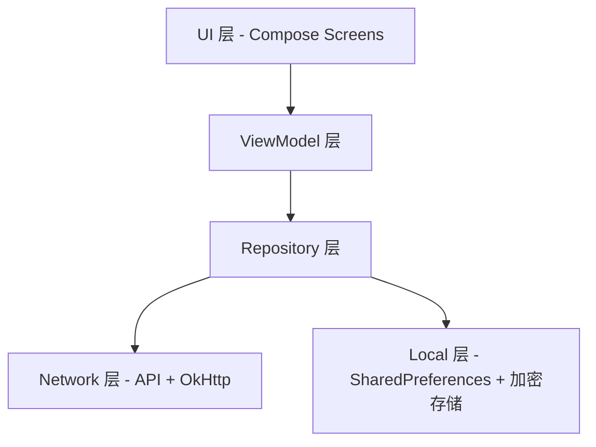

# 电费查询 — 校园服务 Android 客户端

基于 **Kotlin + Jetpack Compose** 构建的校园综合服务应用，主要功能包括电费查询与充值、校园卡服务、办事大厅、扫码支付等。

---

## 技术栈

| 类别 | 技术选型 |
|------|---------|
| 语言 | Kotlin |
| UI 框架 | Jetpack Compose + Material 3 |
| 网络请求 | OkHttp 4.12 |
| JSON 解析 | Gson 2.11 |
| 异步框架 | Kotlin Coroutines |
| 导航 | Navigation Compose 2.8 |
| 图片加载 | Coil 2.7 |
| 二维码 | ZXing 3.5 |
| 相机 | CameraX 1.4 |
| 动态取色 | MaterialKolor 4.1 |
| 加密存储 | AndroidX Security Crypto |
| 构建系统 | Gradle 9.x + Version Catalog |

---

## 架构概览

项目采用 **单 Activity + Compose Navigation** 架构，按功能模块分包，数据层遵循 Repository 模式：



---

## 项目目录结构

```
.
├── .github/                          # CI/CD 配置
├── .kotlin/                          # Kotlin 编译缓存
├── gradle/                           # Gradle Wrapper 与版本目录
├── plans/                            # 开发计划与分析文档
└── app/                              # Android 应用模块
    ├── build.gradle.kts              # 模块构建脚本
    ├── version.properties            # 版本号自动递增记录
    ├── proguard-rules.pro            # 混淆规则
    └── src/main/
        ├── AndroidManifest.xml       # 应用清单
        ├── assets/                   # 静态资源（JSON 配置）
        ├── res/                      # Android 资源文件
        └── java/edu/cqwu/electricity/
            ├── ElectricityApp.kt     # Application 入口
            ├── MainActivity.kt       # 唯一 Activity
            ├── data/                 # 数据层
            │   ├── local/            # 本地存储
            │   ├── model/            # 数据模型
            │   ├── network/          # 网络 API 与加密
            │   └── repository/       # 数据仓库
            ├── ui/                   # UI 层
            │   ├── cardcenter/       # 校园卡中心
            │   ├── components/       # 可复用通用组件
            │   ├── electricity/      # 电费查询与监控
            │   ├── feedback/         # 意见反馈
            │   ├── feeservicehall/   # 缴费服务大厅
            │   ├── hall/             # 办事大厅
            │   ├── home/             # 首页
            │   ├── login/            # 登录（账号 + 扫码）
            │   ├── myroom/           # 我的宿舍
            │   ├── navigation/       # 路由与导航壳
            │   ├── notice/           # 通知公告
            │   ├── profile/          # 个人中心与我的信息
            │   ├── qrcode/           # 二维码显示
            │   ├── recharge/         # 电费充值
            │   ├── scan/             # 扫码页面
            │   ├── settings/         # 设置（主题、UA、关于等）
            │   ├── theme/            # Material 3 主题系统
            │   └── webview/          # 内置浏览器
            └── util/                 # 工具类
```

---

## 文件详解

### 1. 根目录配置文件

| 文件 | 作用 |
|------|------|
| [`build.gradle.kts`](build.gradle.kts) | 项目根构建脚本，声明插件（Android Application、Kotlin Compose）供子模块引用，本身不包含具体构建逻辑 |
| [`settings.gradle.kts`](settings.gradle.kts) | 项目设置文件：定义项目名称为「电费查询」、配置 Maven 仓库（Google、MavenCentral）、引入 `:app` 模块 |
| [`gradle.properties`](gradle.properties) | Gradle 全局属性配置，如 JVM 内存参数、AndroidX 启用等 |
| [`gradle/libs.versions.toml`](gradle/libs.versions.toml) | **版本目录**（Version Catalog），集中管理所有依赖库的版本号、库声明和插件声明，避免各模块版本不一致 |
| [`gradle/gradle-daemon-jvm.properties`](gradle/gradle-daemon-jvm.properties) | Gradle Daemon 的 JVM 配置 |
| [`gradle/wrapper/gradle-wrapper.jar`](gradle/wrapper/gradle-wrapper.jar) | Gradle Wrapper JAR，确保团队成员使用一致的 Gradle 版本 |
| [`local.properties`](local.properties) | 本地环境配置（SDK 路径等），不纳入版本控制 |

### 2. CI/CD

| 文件 | 作用 |
|------|------|
| [`.github/workflows/build.yml`](.github/workflows/build.yml) | GitHub Actions 工作流：在 push/PR 到 `main` 分支时自动构建 Debug 和 Release APK，并上传为 Artifact |

### 3. App 模块配置

| 文件 | 作用 |
|------|------|
| [`app/build.gradle.kts`](app/build.gradle.kts) | app 模块构建脚本：配置 compileSdk 36、minSdk 23、targetSdk 36；启用 Compose 和 BuildConfig；声明所有依赖；实现 **versionCode 自动递增**（每次 assemble 后 +1） |
| [`app/version.properties`](app/version.properties) | 记录当前 versionCode（当前值：1029），由构建脚本自动更新 |
| [`app/proguard-rules.pro`](app/proguard-rules.pro) | Release 构建的 ProGuard/R8 混淆规则 |
| [`app/src/main/AndroidManifest.xml`](app/src/main/AndroidManifest.xml) | 应用清单：声明 `INTERNET` 和 `CAMERA` 权限、注册 `ElectricityApp` 为 Application、注册 `MainActivity` 为启动 Activity、配置 FileProvider |

### 4. 应用入口

| 文件 | 作用 |
|------|------|
| [`ElectricityApp.kt`](app/src/main/java/edu/cqwu/electricity/ElectricityApp.kt) | 自定义 `Application` 类。负责：① 初始化 `CrashHandler`（崩溃捕获）；② 初始化 `SharedHttpClient`（全局共享 OkHttp 客户端）；③ 配置 Coil `ImageLoader`（内存缓存 30%、磁盘缓存 100MB、crossfade 动画） |
| [`MainActivity.kt`](app/src/main/java/edu/cqwu/electricity/MainActivity.kt) | 唯一 Activity。启用边到边绘制，管理全局状态（夜间模式、主题颜色源、动画设置、标题栏样式），通过 `CompositionLocalProvider` 向下传递设置状态，挂载 `AppShell` 导航壳 |

### 5. 数据层 — data/local（本地存储）

| 文件 | 作用 |
|------|------|
| [`AccountStore.kt`](app/src/main/java/edu/cqwu/electricity/data/local/AccountStore.kt) | 多账号持久化存储（加密版）。使用 `EncryptedSharedPreferences`（AES-256）加密保存学号和密码，支持多账号列表管理、记住密码开关 |
| [`SettingsPreferences.kt`](app/src/main/java/edu/cqwu/electricity/data/local/SettingsPreferences.kt) | 应用设置持久化存储。保存：夜间模式（跟随系统/浅色/深色）、主题颜色源（动态取色/自定义种子色）、页面过渡动画类型、减少动画开关、QR 码设置、自定义服务入口列表、WebView User-Agent 配置等。定义了 `NightMode`、`ThemeColorSource`、`PageTransition`、`ReduceMotion` 等枚举 |
| [`CredentialExporter.kt`](app/src/main/java/edu/cqwu/electricity/data/local/CredentialExporter.kt) | 凭据加密导出/解密导入工具。使用 PBKDF2-HMAC-SHA256 派生密钥 + AES-256-GCM 认证加密，输出 Base64 格式，支持多账号批量导出 |

### 6. 数据层 — data/model（数据模型）

| 文件 | 作用 |
|------|------|
| [`Models.kt`](app/src/main/java/edu/cqwu/electricity/data/model/Models.kt) | **核心数据模型集合**，包含：`BuildingNode`（楼栋树节点）、`BalanceResponse`（电费余额响应）、`UsageRecord`/`UsageResponse`（用电记录）、`HourDataRecord`（小时级用电）、`CurrentDataResponse`（电表实时数据：电流/电压/功率）、`RechargeResponse`（充值响应）、`BuyRecord`/`BuyListResponse`（充值记录）、`UserRoomInfo`（用户房间信息）、`SelectionStep` 枚举、`DetailType` 枚举、支付方式相关模型等 |
| [`AccountInfo.kt`](app/src/main/java/edu/cqwu/electricity/data/model/AccountInfo.kt) | EPay 账户信息模型（与 `AccountStore` 的本地存储模型不同） |
| [`StudentInfo.kt`](app/src/main/java/edu/cqwu/electricity/data/model/StudentInfo.kt) | 学生信息模型 |
| [`HallItem.kt`](app/src/main/java/edu/cqwu/electricity/data/model/HallItem.kt) | 办事大厅应用条目模型 |
| [`HomeData.kt`](app/src/main/java/edu/cqwu/electricity/data/model/HomeData.kt) | 首页数据模型 |
| [`HomeAppIds.kt`](app/src/main/java/edu/cqwu/electricity/data/model/HomeAppIds.kt) | 首页应用 ID 常量定义 |
| [`CustomServiceEntry.kt`](app/src/main/java/edu/cqwu/electricity/data/model/CustomServiceEntry.kt) | 用户自定义服务入口模型 |

### 7. 数据层 — data/network（网络与加密）

| 文件 | 作用 |
|------|------|
| [`ApiConfig.kt`](app/src/main/java/edu/cqwu/electricity/data/network/ApiConfig.kt) | API 配置常量集中管理。定义所有后端接口 URL（电费系统 `electricitypay.cqwu.edu.cn`、办事大厅 `ehall.cqwu.edu.cn`、CAS 认证 `authserver.cqwu.edu.cn`、支付网关 `pay.cqwu.edu.cn`）、默认请求头、RSA 公钥 |
| [`ElectricityApi.kt`](app/src/main/java/edu/cqwu/electricity/data/network/ElectricityApi.kt) | 电费系统核心 API。封装楼栋查询、余额查询、6 个月用电、本月每日用电、24 小时用电明细、电表实时数据、充值下单等接口 |
| [`CasAuthApi.kt`](app/src/main/java/edu/cqwu/electricity/data/network/CasAuthApi.kt) | CAS 统一认证登录 API。实现完整的 CAS 登录流程：获取登录页 → 解析 salt/lt/execution → AES-CBC 加密密码 → POST 登录 → 提取 CASTGC Cookie。包含 `PreferIPv4Dns`（IPv4 优先 DNS 解析器，避免 IPv6 超时）和 `SharedHttpClient`（全局共享 OkHttp 单例） |
| [`CampusphereApi.kt`](app/src/main/java/edu/cqwu/electricity/data/network/CampusphereApi.kt) | 校园网/Campusphere 相关 API |
| [`FeeServiceHallApi.kt`](app/src/main/java/edu/cqwu/electricity/data/network/FeeServiceHallApi.kt) | 缴费服务大厅 API，封装订单查询、订单详情等接口 |
| [`QrCodeApi.kt`](app/src/main/java/edu/cqwu/electricity/data/network/QrCodeApi.kt) | 二维码 API。获取支付码/乘车码，通过 followRedirects 自动完成 CAS ticket 交换 |
| [`QrLoginApi.kt`](app/src/main/java/edu/cqwu/electricity/data/network/QrLoginApi.kt) | 扫码登录 API。处理扫码登录的轮询和确认流程 |
| [`SessionChecker.kt`](app/src/main/java/edu/cqwu/electricity/data/network/SessionChecker.kt) | 会话检查器，检测当前登录态是否有效 |
| [`SessionValidator.kt`](app/src/main/java/edu/cqwu/electricity/data/network/SessionValidator.kt) | 会话验证器，提供更细粒度的会话有效性校验 |
| [`SessionExpiredException.kt`](app/src/main/java/edu/cqwu/electricity/data/network/SessionExpiredException.kt) | 会话过期异常类 |
| [`CookieStore.kt`](app/src/main/java/edu/cqwu/electricity/data/network/CookieStore.kt) | Cookie 存储，桥接 `android.webkit.CookieManager` 实现磁盘持久化 |
| [`CookieStoreOkHttpJar.kt`](app/src/main/java/edu/cqwu/electricity/data/network/CookieStoreOkHttpJar.kt) | OkHttp `CookieJar` 实现，将 OkHttp 的 Cookie 读写桥接到 `CookieStore`，使 OkHttp 与 WebView 共享同一 Cookie Session |
| [`AesEncrypt.kt`](app/src/main/java/edu/cqwu/electricity/data/network/AesEncrypt.kt) | AES 加密工具（用于 CAS 登录密码加密） |
| [`RSAEncrypt.kt`](app/src/main/java/edu/cqwu/electricity/data/network/RSAEncrypt.kt) | RSA 加密工具 |
| [`WebVpnEncoder.kt`](app/src/main/java/edu/cqwu/electricity/data/network/WebVpnEncoder.kt) | WebVPN URL 加密转换工具。将外网 URL 通过 AES-128-CBC 加密转换为 `clientvpn.cqwu.edu.cn` 代理 URL，支持正向转换和反向解码 |
| [`UserAgentInterceptor.kt`](app/src/main/java/edu/cqwu/electricity/data/network/UserAgentInterceptor.kt) | OkHttp 拦截器，自动将 `UserAgentProvider` 中的 UA 注入到所有 HTTP 请求 |
| [`UserAgentProvider.kt`](app/src/main/java/edu/cqwu/electricity/data/network/UserAgentProvider.kt) | User-Agent 提供者，管理当前使用的浏览器标识字符串 |

### 8. 数据层 — data/repository（数据仓库）

| 文件 | 作用 |
|------|------|
| [`ElectricityRepository.kt`](app/src/main/java/edu/cqwu/electricity/data/repository/ElectricityRepository.kt) | 电费数据仓库，封装电费相关 API 调用，供 ViewModel 层消费 |
| [`LoginRepository.kt`](app/src/main/java/edu/cqwu/electricity/data/repository/LoginRepository.kt) | 登录数据仓库，封装 CAS 登录、会话管理等逻辑 |
| [`HallFavoriteApi.kt`](app/src/main/java/edu/cqwu/electricity/data/repository/HallFavoriteApi.kt) | 办事大厅收藏 API，处理应用收藏/取消收藏 |
| [`HallServiceCenterApi.kt`](app/src/main/java/edu/cqwu/electricity/data/repository/HallServiceCenterApi.kt) | 办事大厅服务中心 API，获取全部应用列表 |
| [`HallJsonLoader.kt`](app/src/main/java/edu/cqwu/electricity/data/repository/HallJsonLoader.kt) | 办事大厅 JSON 数据加载器，从 `assets/hall_apps.json` 加载本地配置 |
| [`HomeJsonLoader.kt`](app/src/main/java/edu/cqwu/electricity/data/repository/HomeJsonLoader.kt) | 首页 JSON 数据加载器，从 `assets/home_apps.json` 加载本地配置 |

### 9. UI 层 — navigation（导航系统）

| 文件 | 作用 |
|------|------|
| [`NavGraph.kt`](app/src/main/java/edu/cqwu/electricity/ui/navigation/NavGraph.kt) | **导航图核心文件**。定义所有路由常量（`Routes` 对象）和 `NavHost`，管理页面跳转与参数传递，实现页面过渡动画（支持滑动、淡入、缩放、Cupertino 等 6 种效果） |
| [`AppShell.kt`](app/src/main/java/edu/cqwu/electricity/ui/navigation/AppShell.kt) | 导航壳组件，包含底部导航栏和 `NavHost`，是整个应用的 UI 骨架 |
| [`BottomNavTab.kt`](app/src/main/java/edu/cqwu/electricity/ui/navigation/BottomNavTab.kt) | 底部导航栏 Tab 定义（首页、我的等） |
| [`MainTabScreen.kt`](app/src/main/java/edu/cqwu/electricity/ui/navigation/MainTabScreen.kt) | 主 Tab 页面容器，使用 `HorizontalPager` 实现左右滑动切换 Tab |

### 10. UI 层 — home（首页）

| 文件 | 作用 |
|------|------|
| [`HomeScreen.kt`](app/src/main/java/edu/cqwu/electricity/ui/home/HomeScreen.kt) | 首页界面（1000+ 行）。展示校园服务入口网格（电费查询、充值、卡中心、办事大厅等），支持搜索、下拉刷新、自定义服务入口管理、打开外部链接等 |
| [`HomeViewModel.kt`](app/src/main/java/edu/cqwu/electricity/ui/home/HomeViewModel.kt) | 首页 ViewModel，管理首页数据加载与状态 |

### 11. UI 层 — login（登录）

| 文件 | 作用 |
|------|------|
| [`LoginScreen.kt`](app/src/main/java/edu/cqwu/electricity/ui/login/LoginScreen.kt) | 登录界面。支持学号+密码登录，提供多账号下拉选择、记住密码、账号管理等功能 |
| [`LoginViewModel.kt`](app/src/main/java/edu/cqwu/electricity/ui/login/LoginViewModel.kt) | 登录 ViewModel，处理登录逻辑、错误提示、会话管理 |
| [`QrLoginScreen.kt`](app/src/main/java/edu/cqwu/electricity/ui/login/QrLoginScreen.kt) | 扫码登录界面，展示二维码供用户扫码认证 |

### 12. UI 层 — electricity（电费查询）

| 文件 | 作用 |
|------|------|
| [`ElectricityMainScreen.kt`](app/src/main/java/edu/cqwu/electricity/ui/electricity/ElectricityMainScreen.kt) | 电费查询主入口页面 |
| [`ElectricityViewModel.kt`](app/src/main/java/edu/cqwu/electricity/ui/electricity/ElectricityViewModel.kt) | 电费查询 ViewModel，管理楼栋选择、余额查询等状态 |
| [`BuildingSelectionScreen.kt`](app/src/main/java/edu/cqwu/electricity/ui/electricity/BuildingSelectionScreen.kt) | 楼栋选择页面（校区→楼栋→楼层→房间 多级选择） |
| [`DashboardScreen.kt`](app/src/main/java/edu/cqwu/electricity/ui/electricity/DashboardScreen.kt) | 电费仪表盘页面，展示余额、用电趋势图表、快捷操作入口 |
| [`DetailScreen.kt`](app/src/main/java/edu/cqwu/electricity/ui/electricity/DetailScreen.kt) | 用电详情页面（6 个月记录/本月每日/24 小时明细/电表状态） |
| [`DetailViewModel.kt`](app/src/main/java/edu/cqwu/electricity/ui/electricity/DetailViewModel.kt) | 详情页 ViewModel |

### 13. UI 层 — recharge（充值）

| 文件 | 作用 |
|------|------|
| [`RechargeScreen.kt`](app/src/main/java/edu/cqwu/electricity/ui/recharge/RechargeScreen.kt) | 充值页面，输入金额并选择支付方式 |
| [`RechargeViewModel.kt`](app/src/main/java/edu/cqwu/electricity/ui/recharge/RechargeViewModel.kt) | 充值 ViewModel，管理充值流程状态 |
| [`PaymentSelectionScreen.kt`](app/src/main/java/edu/cqwu/electricity/ui/recharge/PaymentSelectionScreen.kt) | 支付方式选择页面 |
| [`PaymentWebViewEngine.kt`](app/src/main/java/edu/cqwu/electricity/ui/recharge/PaymentWebViewEngine.kt) | 支付 WebView 引擎，处理第三方支付页面的加载与回调 |
| [`RechargeRecordScreen.kt`](app/src/main/java/edu/cqwu/electricity/ui/recharge/RechargeRecordScreen.kt) | 充值记录查询页面 |

### 14. UI 层 — cardcenter（校园卡中心）

| 文件 | 作用 |
|------|------|
| [`CardCenterScreen.kt`](app/src/main/java/edu/cqwu/electricity/ui/cardcenter/CardCenterScreen.kt) | 校园卡中心主页 |
| [`AccountInfoScreen.kt`](app/src/main/java/edu/cqwu/electricity/ui/cardcenter/AccountInfoScreen.kt) | 账户信息页面 |
| [`BillScreen.kt`](app/src/main/java/edu/cqwu/electricity/ui/cardcenter/BillScreen.kt) | 账单查询页面 |
| [`BillViewModel.kt`](app/src/main/java/edu/cqwu/electricity/ui/cardcenter/BillViewModel.kt) | 账单 ViewModel |
| [`CardLostScreen.kt`](app/src/main/java/edu/cqwu/electricity/ui/cardcenter/CardLostScreen.kt) | 卡挂失页面 |

### 15. UI 层 — feeservicehall（缴费服务大厅）

| 文件 | 作用 |
|------|------|
| [`FeeServiceHallScreen.kt`](app/src/main/java/edu/cqwu/electricity/ui/feeservicehall/FeeServiceHallScreen.kt) | 缴费服务大厅主页 |
| [`FeeServiceHallViewModel.kt`](app/src/main/java/edu/cqwu/electricity/ui/feeservicehall/FeeServiceHallViewModel.kt) | 大厅 ViewModel |
| [`FeeServiceHallOrderTab.kt`](app/src/main/java/edu/cqwu/electricity/ui/feeservicehall/FeeServiceHallOrderTab.kt) | 订单列表 Tab 页 |
| [`FeeServiceHallProfileTab.kt`](app/src/main/java/edu/cqwu/electricity/ui/feeservicehall/FeeServiceHallProfileTab.kt) | 个人资料 Tab 页 |
| [`OrderDetailScreen.kt`](app/src/main/java/edu/cqwu/electricity/ui/feeservicehall/OrderDetailScreen.kt) | 订单详情页面 |

### 16. UI 层 — hall（办事大厅）

| 文件 | 作用 |
|------|------|
| [`HallScreen.kt`](app/src/main/java/edu/cqwu/electricity/ui/hall/HallScreen.kt) | 办事大厅页面，展示校内应用列表，支持收藏管理 |
| [`HallViewModel.kt`](app/src/main/java/edu/cqwu/electricity/ui/hall/HallViewModel.kt) | 办事大厅 ViewModel |

### 17. UI 层 — notice（通知公告）

| 文件 | 作用 |
|------|------|
| [`NoticeScreen.kt`](app/src/main/java/edu/cqwu/electricity/ui/notice/NoticeScreen.kt) | 通知公告列表页面 |
| [`NoticeDetailScreen.kt`](app/src/main/java/edu/cqwu/electricity/ui/notice/NoticeDetailScreen.kt) | 通知公告详情页面 |
| [`NoticeViewModel.kt`](app/src/main/java/edu/cqwu/electricity/ui/notice/NoticeViewModel.kt) | 通知公告 ViewModel |
| [`NoticeApi.kt`](app/src/main/java/edu/cqwu/electricity/ui/notice/NoticeApi.kt) | 通知公告 API |

### 18. UI 层 — profile（个人中心）

| 文件 | 作用 |
|------|------|
| [`ProfileScreen.kt`](app/src/main/java/edu/cqwu/electricity/ui/profile/ProfileScreen.kt) | 个人中心页面（「我的」Tab），展示用户头像、学号、功能入口列表 |
| [`MyInfoScreen.kt`](app/src/main/java/edu/cqwu/electricity/ui/profile/MyInfoScreen.kt) | 我的信息页面，展示详细的学生信息 |
| [`MyInfoViewModel.kt`](app/src/main/java/edu/cqwu/electricity/ui/profile/MyInfoViewModel.kt) | 我的信息 ViewModel |

### 19. UI 层 — qrcode / scan（二维码与扫码）

| 文件 | 作用 |
|------|------|
| [`QrCodeDisplayScreen.kt`](app/src/main/java/edu/cqwu/electricity/ui/qrcode/QrCodeDisplayScreen.kt) | 二维码展示页面（支付码、乘车码） |
| [`ScanScreen.kt`](app/src/main/java/edu/cqwu/electricity/ui/scan/ScanScreen.kt) | 扫码页面，使用 CameraX 实现实时扫码 |

### 20. UI 层 — settings（设置）

| 文件 | 作用 |
|------|------|
| [`SettingsScreen.kt`](app/src/main/java/edu/cqwu/electricity/ui/settings/SettingsScreen.kt) | 设置主页 |
| [`PersonalizationScreen.kt`](app/src/main/java/edu/cqwu/electricity/ui/settings/PersonalizationScreen.kt) | 个性化设置页面（夜间模式、主题色、动画效果） |
| [`QrCodeSettingsScreen.kt`](app/src/main/java/edu/cqwu/electricity/ui/settings/QrCodeSettingsScreen.kt) | 二维码样式设置页面 |
| [`UserAgentSettingsScreen.kt`](app/src/main/java/edu/cqwu/electricity/ui/settings/UserAgentSettingsScreen.kt) | 浏览器标识 UA 设置页面 |
| [`UserAgentEditScreen.kt`](app/src/main/java/edu/cqwu/electricity/ui/settings/UserAgentEditScreen.kt) | 编辑/添加自定义 UA 条目 |
| [`ConfigScreen.kt`](app/src/main/java/edu/cqwu/electricity/ui/settings/ConfigScreen.kt) | 高级配置页面 |
| [`AboutScreen.kt`](app/src/main/java/edu/cqwu/electricity/ui/settings/AboutScreen.kt) | 关于页面 |

### 21. UI 层 — webview（内置浏览器）

| 文件 | 作用 |
|------|------|
| [`UnifiedWebViewScreen.kt`](app/src/main/java/edu/cqwu/electricity/ui/webview/UnifiedWebViewScreen.kt) | 通用内置浏览器页面，封装 WebView 组件，支持加载任意 URL、自定义标题、错误页面覆盖等 |

### 22. UI 层 — feedback（意见反馈）

| 文件 | 作用 |
|------|------|
| [`FeedbackScreen.kt`](app/src/main/java/edu/cqwu/electricity/ui/feedback/FeedbackScreen.kt) | 意见反馈页面 |
| [`LogCapture.kt`](app/src/main/java/edu/cqwu/electricity/ui/feedback/LogCapture.kt) | 日志捕获工具，收集应用运行日志用于反馈附件 |

### 23. UI 层 — myroom（我的宿舍）

| 文件 | 作用 |
|------|------|
| [`MyRoomViewModel.kt`](app/src/main/java/edu/cqwu/electricity/ui/myroom/MyRoomViewModel.kt) | 我的宿舍 ViewModel，管理用户绑定的房间信息 |

### 24. UI 层 — components（通用组件）

| 文件 | 作用 |
|------|------|
| [`BottomSheetDialog.kt`](app/src/main/java/edu/cqwu/electricity/ui/components/BottomSheetDialog.kt) | 底部弹出对话框组件 |
| [`CustomWebsiteDialog.kt`](app/src/main/java/edu/cqwu/electricity/ui/components/CustomWebsiteDialog.kt) | 自定义网站输入对话框 |
| [`DeferredContent.kt`](app/src/main/java/edu/cqwu/electricity/ui/components/DeferredContent.kt) | 延迟加载内容组件 |
| [`LineChartCard.kt`](app/src/main/java/edu/cqwu/electricity/ui/components/LineChartCard.kt) | 折线图卡片组件（用于用电趋势展示） |
| [`OpenUrlDialog.kt`](app/src/main/java/edu/cqwu/electricity/ui/components/OpenUrlDialog.kt) | 打开链接确认对话框 |
| [`QrCodeView.kt`](app/src/main/java/edu/cqwu/electricity/ui/components/QrCodeView.kt) | 二维码渲染组件（基于 ZXing） |
| [`ReLoginContent.kt`](app/src/main/java/edu/cqwu/electricity/ui/components/ReLoginContent.kt) | 重新登录提示内容组件（会话过期时展示） |
| [`SnackbarController.kt`](app/src/main/java/edu/cqwu/electricity/ui/components/SnackbarController.kt) | Snackbar 消息控制器 |
| [`TabScaffold.kt`](app/src/main/java/edu/cqwu/electricity/ui/components/TabScaffold.kt) | Tab 页脚手架组件（带顶部栏和 Tab 切换） |
| [`WebViewErrorOverlay.kt`](app/src/main/java/edu/cqwu/electricity/ui/components/WebViewErrorOverlay.kt) | WebView 错误覆盖层组件，WebView 加载失败时显示自定义错误页面 |

### 25. UI 层 — theme（主题系统）

| 文件 | 作用 |
|------|------|
| [`Theme.kt`](app/src/main/java/edu/cqwu/electricity/ui/theme/Theme.kt) | Material 3 主题定义。支持夜间模式切换、动态取色（Material You）和自定义种子色，管理状态栏图标颜色、`CompositionLocal` 等 |
| [`Color.kt`](app/src/main/java/edu/cqwu/electricity/ui/theme/Color.kt) | 颜色常量定义 |
| [`Type.kt`](app/src/main/java/edu/cqwu/electricity/ui/theme/Type.kt) | 字体排版样式定义 |
| [`ThemeColorGenerator.kt`](app/src/main/java/edu/cqwu/electricity/ui/theme/ThemeColorGenerator.kt) | 主题色生成器，基于 MaterialKolor 从种子色生成完整调色板 |

### 26. 工具类 — util

| 文件 | 作用 |
|------|------|
| [`CrashHandler.kt`](app/src/main/java/edu/cqwu/electricity/util/CrashHandler.kt) | 全局崩溃捕获器，捕获未处理异常并保存崩溃日志到本地 |
| [`ToastUtils.kt`](app/src/main/java/edu/cqwu/electricity/util/ToastUtils.kt) | Toast 工具类 |
| [`WebViewUrlUtil.kt`](app/src/main/java/edu/cqwu/electricity/util/WebViewUrlUtil.kt) | WebView URL 处理工具 |

### 27. 静态资源 — assets

| 文件 | 作用 |
|------|------|
| [`hall_apps.json`](app/src/main/assets/hall_apps.json) | 办事大厅应用列表本地配置，作为网络请求失败时的兜底数据 |
| [`home_apps.json`](app/src/main/assets/home_apps.json) | 首页服务入口应用列表本地配置 |

### 28. Android 资源 — res

| 文件/目录 | 作用 |
|-----------|------|
| `res/values/strings.xml` | 字符串资源（应用名称等） |
| `res/values/colors.xml` | 颜色资源 |
| `res/values/themes.xml` | 浅色主题样式 |
| `res/values-night/themes.xml` | 深色主题样式 |
| `res/drawable/ic_launcher_background.xml` | 启动图标背景 |
| `res/drawable-v24/ic_launcher_foreground.xml` | 启动图标前景（API 24+自适应图标） |
| `res/mipmap-*/` | 各分辨率启动图标（webp 格式） |
| `res/xml/backup_rules.xml` | Android 备份规则 |
| `res/xml/data_extraction_rules.xml` | 数据提取规则 |
| `res/xml/file_paths.xml` | FileProvider 路径配置（用于日志文件分享等） |

### 29. 根目录辅助文件

| 文件 | 作用 |
|------|------|
| `*.har.txt` | HTTP 抓包记录文件（ProxyPin 导出），用于接口分析和调试参考 |
| `*.txt` | 服务器请求记录、接口文档等开发参考资料 |

---

## 构建与运行

```bash
# 构建 Debug APK
./gradlew assembleDebug

# 构建 Release APK（使用 debug 签名）
./gradlew assembleRelease
```

> **注意：** 每次构建后 `app/version.properties` 中的 `VERSION_CODE` 会自动递增。

---

## 权限说明

| 权限 | 用途 |
|------|------|
| `INTERNET` | 网络请求（API 调用、WebView 加载） |
| `CAMERA` | 扫码功能（ZXing 二维码识别） |
